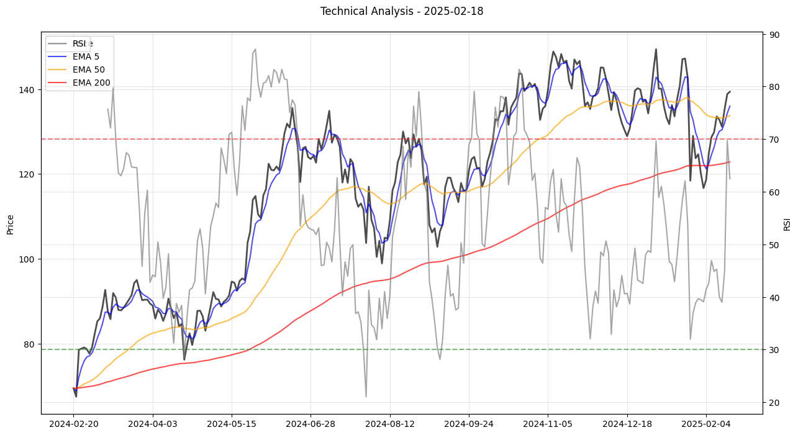

# 股票 EMA 技术分析工具

这是一个基于 Python 的股票技术分析工具，专注于指数移动平均线（EMA）分析和其他技术指标。该工具可以帮助您跟踪和分析多支股票的技术走势，生成详细的分析报告和可视化图表。

## 功能特点

- 多股票同时分析
- EMA（指数移动平均线）交叉检测
- RSI（相对强弱指数）分析
- 价格趋势分析
- 自动警报系统
- 详细的分析报告（HTML 和 Excel 格式）
- 美观的技术指标可视化
- 完全可配置的参数
- Excel 表格条件格式化
- 中英文双语支持

## 安装要求

确保您的系统已安装以下依赖：

```bash
pip install yfinance pandas matplotlib pyyaml openpyxl
```

## 项目结构

```
stock-ema/
├── ema.py           # 主程序文件
├── config.yaml      # 配置文件
├── utils/           # 工具模块
│   ├── alerts.py    # 警报生成
│   ├── analysis.py  # 技术分析
│   ├── config.py    # 配置加载
│   ├── constants.py # 常量定义
│   └── report.py    # 报告生成
├── output/          # 输出目录
│   └── YYYYMMDD_HHMMSS/  # 按时间戳组织的输出文件
│       ├── analysis_results.html  # HTML 分析报告
│       ├── stock_analysis.xlsx    # Excel 分析报告
│       └── *_analysis_plot.png    # 技术分析图表
└── README.md        # 项目文档
```

## 快速开始

1. 克隆或下载项目到本地
2. 安装所需依赖
3. 在 `config.yaml` 中配置需要分析的股票
4. 运行分析程序：
   ```bash
   python ema.py
   ```

## 配置文件说明

配置文件 `config.yaml` 包含所有可自定义的参数：

```yaml
# 股票列表配置
stocks:
  - AAPL   # 苹果
  - MSFT   # 微软
  # 添加更多股票...

# 分析设置
analysis:
  # 回溯时间（天）
  lookback_days: 365
  
  # RSI 设置
  rsi:
    period: 14
    oversold_threshold: 30    # 超卖阈值
    overbought_threshold: 70  # 超买阈值
  
  # EMA 周期设置
  ema_periods:
    short_term: [5, 10, 20]   # 短期均线
    medium_term: [50, 60]     # 中期均线
    long_term: [120, 200]     # 长期均线
```

## 输出文件说明

每次运行程序会在 `output` 目录下创建一个以时间戳命名的新目录，包含以下文件：

1. **HTML 分析报告** (`analysis_results.html`)
   - 完整的技术分析结果
   - 包含交互式图表
   - 警报信息高亮显示
   - 移动设备友好的响应式设计

2. **Excel 分析报告** (`stock_analysis.xlsx`)
   - 概览表：所有股票的当前状态
     - 价格和涨跌幅（红绿色标注）
     - RSI 值（超买超卖状态标注）
     - 警报数量（橙色标注）
   - 详细数据表：每支股票的历史数据
     - 所有技术指标的完整数据
     - RSI 超买超卖状态标注
     - 数据保留两位小数

3. **技术分析图表** (`*_analysis_plot.png`)
   - 清晰的价格和均线走势
   - 完整的图例说明
   - RSI 指标和超买超卖线
   - 优化的日期显示

## 分析指标

1. **EMA 均线**
   - 短期：5、10、20 日
   - 中期：50、60 日
   - 长期：120、200 日
   - 检测均线交叉和趋势变化

2. **RSI 指标**
   - 默认 14 日 RSI
   - 超买水平：70
   - 超卖水平：30
   - 背离检测

3. **价格分析**
   - 与各均线关系
   - 突破和支撑位
   - 趋势强度

## 警报系统

系统会在以下情况触发警报：

1. **均线相关**
   - 金叉（短期均线向上穿过长期均线）
   - 死叉（短期均线向下穿过长期均线）
   - 价格突破重要均线

2. **RSI 相关**
   - 进入超买区域（>70）
   - 进入超卖区域（<30）
   - 背离信号

3. **价格相关**
   - 突破重要价位
   - 跌破支撑位
   - 突破阻力位

## 使用技巧

1. **分析多支股票**
   - 在 `config.yaml` 中添加股票代码
   - 支持同时分析数十支股票
   - 注意网络状况和 API 限制

2. **解读分析报告**
   - HTML 报告适合整体分析
   - Excel 报告适合数据筛选和排序
   - 图表适合技术分析和趋势判断

3. **使用警报系统**
   - 关注警报数量的变化
   - 结合多个警报信号
   - 验证警报的有效性

## 注意事项

1. 数据来源
   - 使用 Yahoo Finance API
   - 数据可能有延迟
   - 建议在非交易时段运行

2. 系统限制
   - API 调用频率限制
   - 历史数据长度限制
   - 部分股票可能数据不完整

3. 分析建议
   - 结合多个技术指标
   - 考虑市场整体环境
   - 不要单一依赖技术分析

## 未来改进计划

1. 功能增强
   - 添加更多技术指标（MACD、布林带等）
   - 实现实时数据更新
   - 添加回测功能

2. 用户体验
   - 开发 Web 界面
   - 添加移动端支持
   - 优化报告展示

3. 数据源
   - 支持更多数据提供商
   - 添加实时行情
   - 提供备选数据源

## 常见问题解答

1. **安装问题**
   - Q: 依赖安装失败
   - A: 使用 `pip install -r requirements.txt`

2. **运行错误**
   - Q: 网络连接错误
   - A: 检查网络连接和代理设置
   - Q: 数据下载失败
   - A: 验证股票代码和市场状态

3. **数据问题**
   - Q: 数据不完整
   - A: 调整回溯时间范围
   - Q: 股票代码无效
   - A: 确认股票代码格式正确

## 贡献指南

欢迎提交改进建议和 bug 报告：

1. Fork 项目
2. 创建功能分支
3. 提交更改
4. 发起 Pull Request

提交代码时请注意：
- 遵循现有代码风格
- 添加必要的注释
- 更新相关文档
- 添加测试用例

## 许可证

MIT License

## 联系方式

如有问题或建议，请通过以下方式联系：
- 提交 Issue
- Pull Request
- 项目讨论区

## 输出示例

### 1. Excel 分析报告示例

**概览表**
```
| 股票代码 | 当前价格  | 价格变化 | 价格变化率(%) |  RSI  | 警报数量 |
|---------|-----------|----------|--------------|-------|----------|
| NVDA    | 785.38    | +7.23    | +0.93%       | 71.25 | 2        |
| AAPL    | 182.31    | -1.25    | -0.68%       | 45.82 | 0        |
| TSLA    | 193.57    | -2.81    | -1.43%       | 28.35 | 1        |
```
- 上涨显示为绿色
- 下跌显示为红色
- RSI > 70 显示为红色（超买）
- RSI < 30 显示为绿色（超卖）
- 有警报的数量显示为橙色

### 2. 技术分析图表示例



图表包含：
- 股票价格（黑色粗线）
- 3 条 EMA 均线
  - 5日均线（蓝色）：短期趋势
  - 50日均线（橙色）：中期趋势
  - 200日均线（红色）：长期趋势
- RSI 指标（灰色）
- 超买超卖水平线（红/绿虚线）
- 完整的图例说明

### 3. HTML 报告示例

```html
<div class="stock-detail">
    <h3>NVDA 详细分析</h3>
    <div class="price-info">
        当前价格：785.38 (+7.23, +0.93%)
    </div>
    <div class="technical-indicators">
        <p>RSI (14): 71.25 - 超买状态</p>
    </div>
    <div class="alerts">
        <h4>警报信息</h4>
        <ul>
            <li>RSI 进入超买区域 (>70)</li>
            <li>价格突破 120 日均线</li>
        </ul>
    </div>
    
</div>
```

### 4. 警报消息示例

```
NVDA 警报：
✓ RSI 进入超买区域：当前 RSI(14) = 71.25
✓ 均线突破：价格突破 120 日均线，可能形成上升趋势

TSLA 警报：
⚠ RSI 进入超卖区域：当前 RSI(14) = 28.35
```

### 5. 运行输出示例

```bash
$ python ema.py
分析股票 AAPL...
分析股票 MSFT...
分析股票 GOOGL...
...

分析完成！
成功分析的股票数量: 23/23
分析结果已保存到目录: output/20250219_140521
生成的文件：
- analysis_results.html：完整分析结果（包含图表和详细信息）
- stock_analysis.xlsx：Excel 分析报告
- *_analysis_plot.png：技术分析图表
